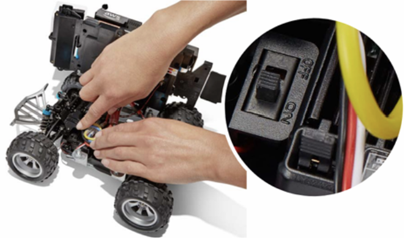
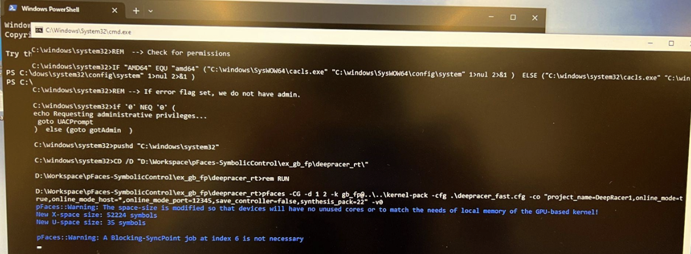
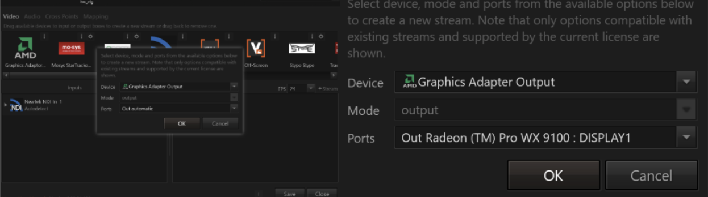

# DeepRacer Demo Procedure  
**LAST UPDATED: May 11, 2025**  

---

## Jump to Section

- [Quick Reference](#quick-reference)
- [DeepRacer Demo - Procedure](#deepracer-demo---procedure)
- [Pre-Procedure Notes](#pre-procedure-notes)
- [Main Procedure](#main-procedure)
- [Other Procedures](#other-procedures)
- [DeepRacer Demo - Troubleshoot](#deepracer-demo---troubleshoot)
- [Basic Issues](#basic-issues)
- [Ventuz - Multi-Projector Setup](#ventuz---multi-projector-setup)
- [Controller Graphics Card - HP Z8 G4 Workstation](#controller-graphics-card---hp-z8-g4-workstation)

---

## Quick Reference

### Media Server:
192.168.1.194:12345/OptiTrackRestServer

### pFaces Server:
192.168.1.144:12345/pFaces/REST/dictionary/DeepRacer1

### pFaces:
D:/Workspace/pFaces-SymbolicControl/ex_gb_fp/deepracer_rt/run_d_1_2_fast.bat

---


## DeepRacer Demo - Procedure
### Pre-Procedure Notes
1. **DeepRacer Power-Up**
   - Charge both robot batteries: one for the drivetrain and one for the compute board. If battery is low, the robot may ignore compute server commands.

2. **Compute Server IP Configuration**
   On the compute server PC, run the command below to find the IPv4 address:
   ```
   ipconfig
   ```
   Do the same for the media server PC.
   
   Open the following Python files on the deepracer:
   - deepracer-utils/examples/sym_control/closedloop_rt.py
   - deepracer-utils/examples/sym_control/closedloop_online.py
   
   Make sure the IP addresses are current (example):
   ```
   LOCALIZATION_SERVER_IPPORT = "192.168.1.194:12345"
   COMPUTE_SERVER_IPPORT = "192.168.1.147:12345"
   ```

3. **SSH into Robot**
   Use this to connect:
   ```
   ssh deepracer@192.168.1.70
   ```
   Password: `deepracer1234`
   
   If SSH times out, retry multiple times until it connects.

4. **Before Running the Controller closedloop_rt**
   Place one obstacle and one target on the grid. The system won't respond if these are missing.

5. **Log Files**
   Each time closedloop_rt.py runs, a log file is saved in:
   ```
   deepracer-utils/examples/sym_control/
   ```
   Format: %d%m%Y%H%M (e.g., 110520251810 = May 11, 2025 18:10)


### Main Procedure

**Projectors and DeepRacer:**
(Make sure not to hit the reset button (the one next to the power button) on the robot)
   - Connect the drivetrain and compute board batteries to the deepracer. The drivetrain battery connects and charges via the three red wires, while the compute board batteries connect through the USB.
   - Turn the deepracer on (look for a small switch on the chassis, see image below) and place the robot on the grid.



   - Turn on all four projectors and the deepracer. Use the remote and point at projectors and hit on
     - The deepracer power button may take pressing 3 times to work: it blinks white then red the first two times, then lights a stable white on the third time.
   - The cameras will be on after initializing the environment

**2. Media Server PC: GUI**

a. In a terminal app:
```
cd D:/Workspace/ArenaManager
python AutoDeploy.py
```

This script deploys the GUI to initialize the environment (Ventuz, Motive, and localization server) and place obstacles and targets on the grid. Motive tracks marker motion via OptiTrack cameras. Ventuz blends the projected image on the mat.

b. Click "Initialize Environment" and wait for the grid to appear on the mat.

**3. Controller**

On compute server, run the file (shortcut on desktop):
```
D:/Workspace/pFaces-SymbolicControl/ex_gb_fp/deepracer_rt/run_d_1_2_fast.bat
```

This sets up compute server to receive and process data from the robot. The server synthesizes commands and sends {steer, throttle} between -1 and 1. Negative values are for steering left, positive values are for steering right. Negative throttle puts it in reverse.

**DeepRacer 1** (make sure target is on mat)

1. In a new terminal:
```
ssh deepracer@192.168.1.70
```
Password: `deepracer1234`

2. Source environment setup:
```
source /opt/aws/deepracer/setup.sh
```
This sets environmental variables and sources environmental hooks such as python and library paths

3. Run calibration:
```
python ~/deepracer-utils/put_best_cal.py
```
This calibrates for steering and speed via rospy and returns calibration status.

4. Navigate to controller folder:
```
cd deepracer-utils/examples/sym_control
```

5. Run the controller:
```
python closedloop_rt.py
```
This is the controller code. It uses RemoteSymbolicControl to send data to compute server and synthesizes a control loop using DeepRacerController.

### Other Procedures 

**DeepRacer Obstacle:**

1. Run new terminal 

2. SSH to obstacle:
```
ssh root@192.168.1.110
```

3. Password: `deepracer1234`

4. Source ROS environment:
```
source /opt/ros/foxy/setup.sh
```
- Setting up environment paths and customizing runtime environment 

5. Source deepracer workspace:
```
source/root/deepracer_ws/aws-deepracer-servo-pkg/install/setup.sh
```
- This script extends the environment with the environment of other prefix paths which were sourced when this file was generated as well as all packages contained in the prefix path
 
6. Navigate to tools directory:
```
cd deepracer-utils/tools
```

7. Start manual control server:
```
python3 ManualControlServer.py
```
Initiates deepracer obstacle into manual drive mode by utilizing the MotionControls class. By using the python library HTTPServer this script becomes a simple server where manual drive controls are sent to the car. 

8. Run new terminal 

9. Start keyboard control:
```
python C:\Users\CUBLab\Desktop\KeyboardControl.py
```
- Allows the keyboard to control the car. Matches each keyboard action with the necessary action in the car and runs it through ManualControlServer which tells the car what to do.

**DeepRacer1 Procedure with Auto Button:**

1. Open new terminal
2. SSH to deepracer:
   ```
   ssh deepracer@192.168.1.70
   ```
   (retry if it fails)
3. Password: `deepracer1234`
4. Once connected, return to Arena Manager and place targets/obstacles
5. Enable logging if needed (check log), disable before closing apps
6. Hit "connect and go to target" to start
7. After run, hit "transfer and delete files" to save to:
   ```
   C:\Users\CUBLab\Desktop\deepracer-logs
   ```

---

## DeepRacer Demo - Troubleshoot

### Basic Issues

- **Battery Lockout Issue**: If you connect the batteries but there is no beeping when turning the drivetrain on, the battery may be locked out. Take the jumper cable and connect the output and the input connectors of the battery as shown in the figure below.


- **Grid Display Issue**: If (STEP 2b) clicking "Initialize Environment" does not display the grid on the mat, some programs may have failed to boot.
  Exit everything and repeat the setup. If it still fails after several attempts, reboot the computer.

- **Licensing Issue**: If (STEP 3) running the compute server throws a licensing issue, email Mahmoud for a new license and replace it in every folder.
  A blue warning message is normal and can be ignored.



- **SSH Connection Issues**: If (DeepRacer STEP 1) SSH to the robot times out repeatedly, try again. If you've tried over 15 times, reboot the computer and confirm the robot batteries are charged.

- **Robot Movement Issues**: If (DeepRacer STEP 5) the robot doesn't move after running closedloop_rt.py, check:
  - Both batteries are fully charged
  - Correct host URL is used in the symbolic control file

- **Packet Inspection**: To check robot packets, use:
  ```
  sudo tcpdump -w FileName.pcap
  ```
  Then inspect with Wireshark

- **Debug Tips**: Add print statements in all control functions to trace execution.
  If stuck, it's likely trapped in a while loop. Wrap suspicious function calls in try-except blocks.

  Example:
  ```python
  # Get the mode of the server
  def getMode(self):
      return self.rest_client.restGETjson()["mode"]
  ```

- **DeepRacer Obstacle Movement Issue**: If DeepRacer Obstacle moves on its own without script input:
  Shut down everything and reboot until it behaves correctly.

- **Flushing DeepRacer Logs** (if needed):
  1. Connect keyboard and monitor to the robot
  2. Boot the system
  3. If screen is black, press CTRL+ALT and cycle through Fn keys until terminal appears
  4. Run:
     ```
     rm -r /home/deepracer/.ros/log/*
     sudo rm -r /home/deepracer/.ros/log/*
     [Optional] sudo rm -r /var/log/*
     ```
  5. Reboot the system

### Ventuz - Multi-Projector Setup
(for other issues I recommend reaching out to Ventuz on their Discord channel)

**Problem**: When trying to configure Ventuz to span across multiple projectors as a single large display, you may encounter an issue where only one display (DISPLAY1) is visible in the Ventuz configuration app, even though all projectors show signal outside of Ventuz.



**Solution**: (for Ventuz 6.9)

**Clean Graphics Drivers**:
- Use AMD Cleanup Utility to remove existing graphics drivers
- Reinstall the latest drivers for your AMD graphics card

**Configure AMD Eyefinity**:
- Open AMD Radeon Software
- Navigate to the Display settings
- Set up Eyefinity to merge multiple displays into a single large display
- This creates a "spanned" display that Ventuz can recognize as a single output

**Ventuz Configuration**:
- After setting up Eyefinity, launch Ventuz
- The merged display should now appear as a single output option
- Configure this output in Ventuz for your multi-projector setup

**For Ventuz 7+** (in case of future upgrades):

*Windows 10*:
- Ventuz 7+ can handle multiple outputs without requiring display spanning
- Add the AMD device to the Output panel 4 times (once for each output)

*Windows 11*:
- Due to Windows changes to Full-Screen Optimization, you may still need to use AMD Eyefinity/Mosaic mode
- This helps avoid sync issues between displays

### Controller Graphics Card - HP Z8 G4 Workstation

**System Information**
- Model: HP Z8 G4 RCTO Base Model Workstation
- Property Code: UCB 215914 UCPC
- Serial Number: MXL12446V8

**Problem 1: No Display Signal**

*Symptoms*
- No display output
- May receive hardware error 3.3 (no graphic initialization)

*Potential Causes*
- Interference from Dual Port Thunderbolt 3 PCIe AiC card
- NVIDIA graphics card connection issues

*Troubleshooting Steps* (following official guide HP Thunderbolt 3 PCIe Card Installation)
- Disconnect the Dual Port Thunderbolt 3 PCIe AiC card
- Ensure at least one NVIDIA card is properly connected
- Power on the system
- Once display is working, update BIOS to v.2.94 Rev A (for Win 10 x64) as recommended in the Dual Port Thunderbolt 3 PCIe AiC installation guide

**Problem 2: RAM Memory Recognition (Error 3.2)**

*Symptoms*
- Error 3.2 (no memory initialization)
- System fails to recognize installed RAM

*Resolution: CMOS Reset Procedure*
1. Power down the system completely:
   - Shut down the system
   - Disconnect the AC power cord
   - Remove all external devices
2. Reset the CMOS:
   - Locate the yellow CMOS reset switch on the system board
   - Press and hold for 5-8 seconds
3. Establish minimal configuration:
   - Keep only essential components:
     - System board
     - Power supply
     - Processor
     - One known working memory module
4. Restore connections:
   - Reattach the access panel
   - Reconnect the power cord
5. Test the system:
   - Power on the workstation
   - Verify the system completes POST (Power On Self Test)
